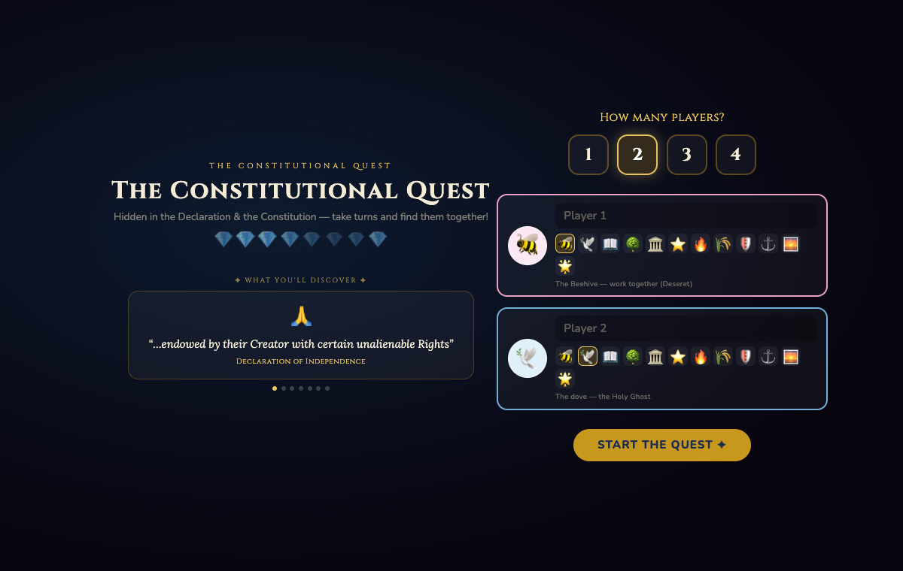
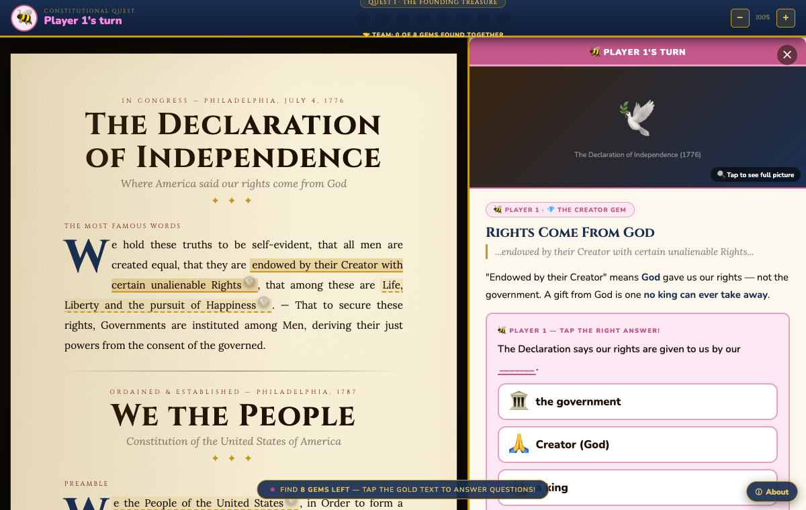
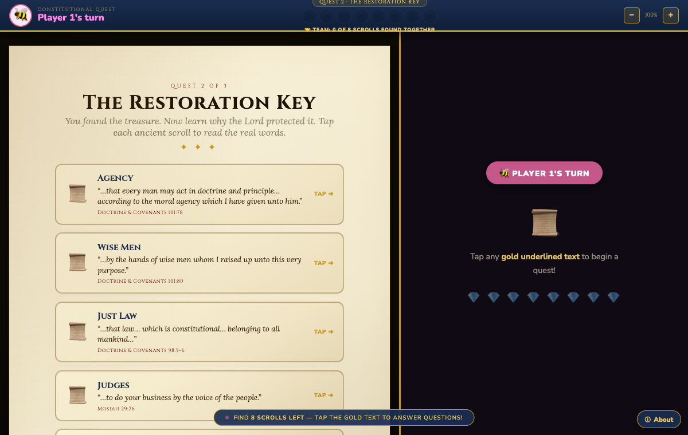
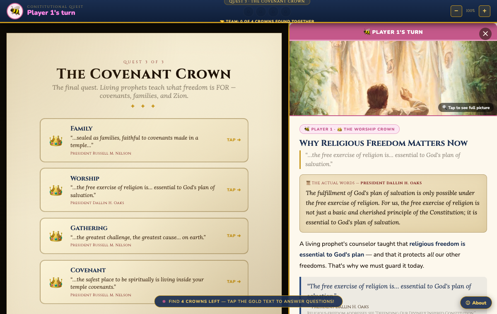
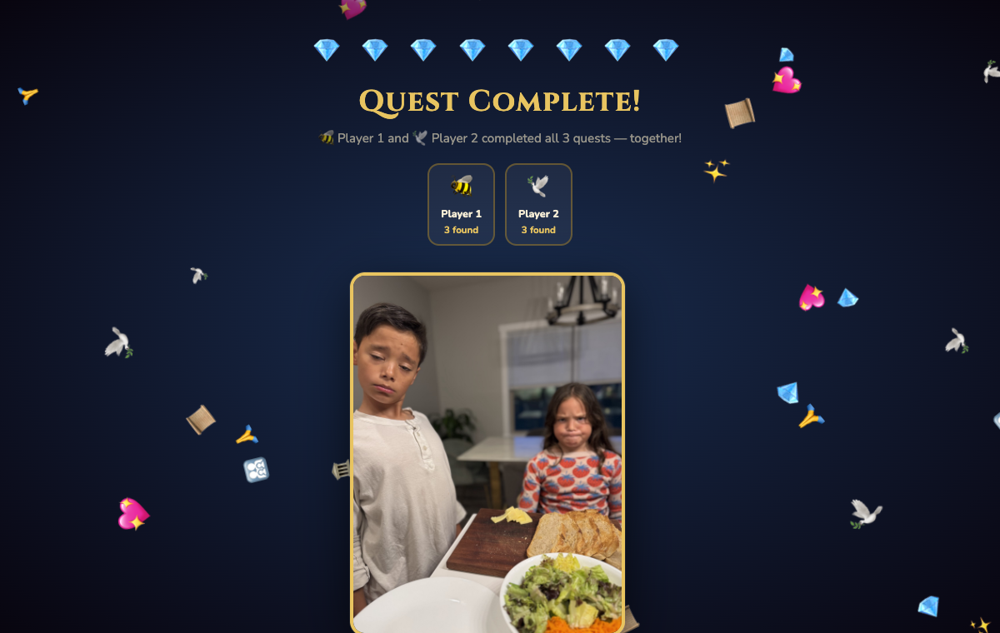

# The Constitutional Quest 🇺🇸💎📜👑

A faith-building, kid-friendly **treasure-hunt game** that teaches the **Declaration of Independence**, the **Constitution**, and how religious freedom enabled the **Restoration of the Church** — built for Family Home Evening, aligned with the First Presidency's 2026 invitation to teach the significance of America's founding documents and to give thanks for religious liberty.

### ▶️ Play it free: **[constitutional-quest-lds.netlify.app](https://constitutional-quest-lds.netlify.app)**
No install. Works on a phone, tablet, or computer. 1–4 players take turns together.

📄 **[Download the FHE / Teacher Guide (PDF)](constitutional-quest-fhe-guide.pdf)** — how to run it, talking points, and verified scripture/prophet sources.

---

## The doctrinal arc — three quests, getting deeper

> **God gave us rights → the Constitution protected them → religious freedom → the Restoration → temples → families together forever.**

| | Quest | Artifact | Question it answers |
|---|---|---|---|
| 💎 | **The Founding Treasure** | gems in the documents | *"What happened?"* |
| 📜 | **The Restoration Key** | scripture scrolls | *"Why did God care?"* |
| 👑 | **The Covenant Crown** | living-prophet teachings | *"What is freedom **for**?"* |

Finish one quest to unlock the next.

---

## Screenshots

**Start screen — pick players & avatars (each is an LDS symbol):**


**Quest 1 — tap a gold phrase, read it, tap the answer (no typing):**


**Quest 2 — scripture "scrolls" showing the actual words (D&C 101, 98; Mosiah 29; Alma 46):**


**Quest 3 — verified living-prophet teachings on why religious freedom matters now:**


**Finale — temples & forever families, with the America 250 invitation:**


---

## Features

- **1–4 players**, automatic turns, pick an LDS-symbol avatar (🐝 beehive, 🕊️ dove, 🏛️ temple…)
- **Tap-to-answer** with scrambled choices — works for kids who can't read or type yet
- A **"why it matters"** chain on every card (Doctrine → Why → Restoration → Temple) and **false-path teaching** (wrong answers explain the right principle)
- **Source scrolls** show the actual scripture/quote words; tap any image for the full painting
- **America 250** finale (July 4, 2026) with verified quotes from Pres. Nelson & Pres. Oaks
- **Share cards** — generates a branded quote image that links back to the game
- Fully **responsive** (phone → desktop), single self-contained `index.html`

## Develop

The whole game is one static `index.html` — just open it in a browser.

```bash
npm install
node test.mjs          # full 3-level Puppeteer playthrough (headless)
```

- Pushes to `main` **auto-deploy** to Netlify via GitHub Actions (`.github/workflows/deploy.yml`).
- A tiny **Netlify Function** (`netlify/functions/shares.mjs`) + Netlify Blobs counts shares.
- **Testing cheats:** add `#level2`, `#level3`, or `#finale` to the URL, or run `cheat(2)` / `cheat('win')` in the console.

## About

Built by **Reif Tauati** ([thegoodproject.net](https://thegoodproject.net) · reif@thegoodproject.net) for his family's FHE, with a little help from Claude. PRs and ideas welcome. 🙂

> *"And for this purpose have I established the Constitution of this land, by the hands of wise men whom I raised up unto this very purpose."* — D&C 101:80

*A note on doctrine: the claim is not that every Founder was a prophet or that America equals Zion — it's that the Lord used wise men to establish constitutional principles that protect moral agency, and those principles belong to all mankind.*
